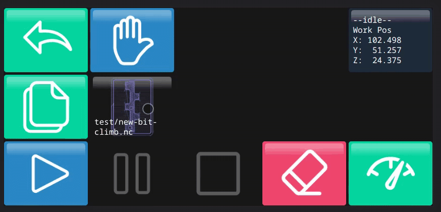
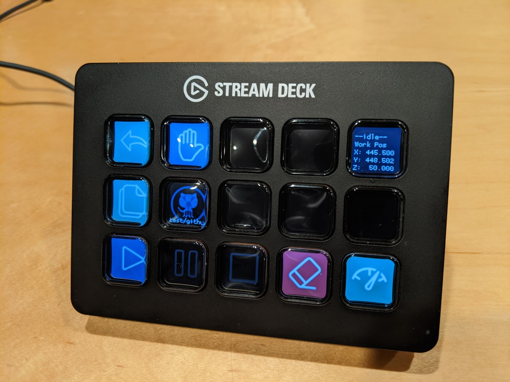

# cncjs-pendant-streamdeck

A ridiculously configurable mobile web and Elgato Stream Deck pendant for CNCjs + Grbl

[](https://www.npmjs.com/package/cncjs-pendant-streamdeck)
[](https://github.com/sponsors/billiam)





The web version acts as a prototype for the Stream Deck, and powerful and useful
pendant as a side effect.

All configuration takes place in `config.json`. An example, mostly matching my own interface, is included to get started.

You can use your own images, or those included with the pendant, courtesy [czottmann's](https://github.com/czottmann)
[system-uicons](https://github.com/czottmann/streamdeck-iconpack-system-uicons) and
[fluent system icons](https://github.com/carlo/streamdeck-iconpack-fluentui-system-icons/blob/main/LICENSE.md) and
a handful from [Font Awesome](https://github.com/FortAwesome/Font-Awesome).

## Features

- Works with or without a Stream Deck, either as CLI process or web pendant
- Linux-friendly, does not use default Stream Deck software
- Unlimited pages
- Arbitrary grid dimensions for web version
- _Excessively_ customizable
- Execute one or more actions on press, release, and/or button hold
- Support up to 6 axes
- Multi axis smooth jogging
- Templated text for
- Lots of included icons, or add your own
- Display and animate gcode
- Run macros
- Run cncjs custom commands (ex: to restart the system or update packages)
- Manage alarms, hold, and pause events (like macro-triggered tool changes)
- Custom configuration is [well documented](https://billiam.github.io/cncjs-pendant-streamdeck/)
- [Configuration validator](https://billiam.github.io/cncjs-pendant-streamdeck/validator/)
- Full GUI config editor

## Compatibility

This has been tested with Grbl 1.1h, CNCjs 1.9.26 and Node 14.20.0+

## Documentation

Full documentation can be found at <https://billiam.github.io/cncjs-pendant-streamdeck>

## Installation

### Web

1. Download the [latest release](https://github.com/Billiam/cncjs-pendant-streamdeck/releases) and extract it, to ex: `/home/my-name/cncjs-pendant-streamdeck`
2. Rename `config.example.json` to `config.json`
3. Update the `config.json` file with your connection information in the [`cncjs`](https://billiam.github.io/cncjs-pendant-streamdeck/docs/configure#cncjs) section.
4. Edit your `~/.cncrc` file, adding a mount point for this pendant
   ```
   "mountPoints": [
     {
       "route": "grid",
       "target": "/home/pi/cncjs-pendant-streamdeck"
     }
   ]
   ```
5. Restart CNCjs

### Streamdeck

Follow [Web](#web) steps above to generate create a configuration directory, `config.json` file, and button images.
You can skip the `cncrc` step if you do not need the web interface.

#### Linux

_Instructions borrowed from https://github.com/julusian/node-elgato-stream-deck_

On linux, the udev subsystem blocks access to the StreamDeck without some special configuration.
Save the following to `/etc/udev/rules.d/50-elgato.rules` and reload the rules with
`sudo udevadm control --reload-rules`

```
SUBSYSTEM=="input", GROUP="input", MODE="0666"
SUBSYSTEM=="usb", ATTRS{idVendor}=="0fd9", ATTRS{idProduct}=="0060", MODE:="666", GROUP="plugdev"
SUBSYSTEM=="usb", ATTRS{idVendor}=="0fd9", ATTRS{idProduct}=="0063", MODE:="666", GROUP="plugdev"
SUBSYSTEM=="usb", ATTRS{idVendor}=="0fd9", ATTRS{idProduct}=="006c", MODE:="666", GROUP="plugdev"
SUBSYSTEM=="usb", ATTRS{idVendor}=="0fd9", ATTRS{idProduct}=="006d", MODE:="666", GROUP="plugdev"
SUBSYSTEM=="usb", ATTRS{idVendor}=="0fd9", ATTRS{idProduct}=="0080", MODE:="666", GROUP="plugdev"
SUBSYSTEM=="usb", ATTRS{idVendor}=="0fd9", ATTRS{idProduct}=="0086", MODE:="666", GROUP="plugdev"
KERNEL=="hidraw*", ATTRS{idVendor}=="0fd9", ATTRS{idProduct}=="0060", MODE:="666", GROUP="plugdev"
KERNEL=="hidraw*", ATTRS{idVendor}=="0fd9", ATTRS{idProduct}=="0063", MODE:="666", GROUP="plugdev"
KERNEL=="hidraw*", ATTRS{idVendor}=="0fd9", ATTRS{idProduct}=="006c", MODE:="666", GROUP="plugdev"
KERNEL=="hidraw*", ATTRS{idVendor}=="0fd9", ATTRS{idProduct}=="006d", MODE:="666", GROUP="plugdev"
KERNEL=="hidraw*", ATTRS{idVendor}=="0fd9", ATTRS{idProduct}=="0080", MODE:="666", GROUP="plugdev"
KERNEL=="hidraw*", ATTRS{idVendor}=="0fd9", ATTRS{idProduct}=="0086", MODE:="666", GROUP="plugdev"
```

Unplug, and replug the device after reloading rules if necessary.

Install Stream Deck and canvas dependencies:

```
apt-get install libusb-1.0-0-dev libudev-dev libcairo2-dev libpango1.0-dev libjpeg-dev libgif-dev librsvg2-dev
```

Install optional node dependencies:

```
npm install -g canvas @julusian/jpeg-turbo
```

Install the application:

```
npm install -g cncjs-pendant-streamdeck
```

Run the pendant

```
cncjs-pendant-streamdeck --directory /home/my-name/cncjs-pendant-streamdeck
```

## Licenses and credits

Several icon sets have been added for convenience

- [czottmann -
  streamdeck-iconpack-fluentui-system-icons - MIT](https://github.com/czottmann/streamdeck-iconpack-fluentui-system-icons/blob/main/LICENSE.md)
- [czottmann - streamdeck-iconpack-system-uicons - MIT](https://github.com/czottmann/streamdeck-iconpack-system-uicons/blob/main/LICENSE.md)
- [fontawesome - CC BY 4.0](https://raw.githubusercontent.com/FortAwesome/Font-Awesome/6.x/LICENSE.txt)  
  Alterations: SVG images have been converted to PNG
